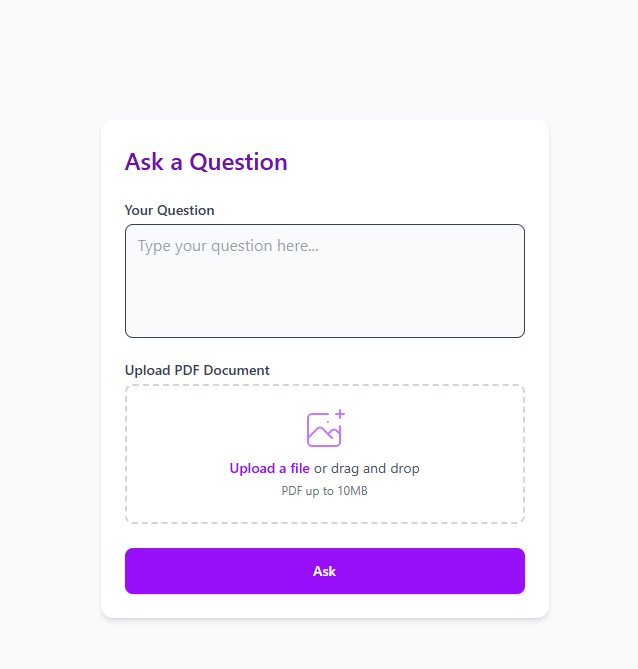

# RAG Pipeline for Document Question Answering

This project leverages a **Retrieval-Augmented Generation (RAG)** pipeline for answering questions based on the content of documents. It supports uploading PDFs via a frontend interface and processes the documents using embeddings, FAISS for vector storage, and a large language model (LLM) for generating answers.

## Table of Contents

- [Overview](#overview)
- [Features](#features)
- [Project Setup](#project-setup)
  - [Frontend Setup](#frontend-setup)
  - [Backend Setup](#backend-setup)
- [API Endpoints](#api-endpoints)
- [How to Use](#how-to-use)
- [Contributing](#contributing)
- [License](#license)

## Overview

This project provides an API that allows users to upload PDFs and ask questions based on their content. The backend uses a **Retrieval-Augmented Generation (RAG)** pipeline to retrieve relevant document chunks using FAISS, and answers are generated using a Hugging Face LLM.
## User Interface

Here is a screenshot of the user interface:



The interface allows users to upload PDFs and ask questions based on their content.

### Key Components:
- **Frontend**: A web interface to upload PDFs and send questions.
- **Backend**: A Flask API that receives the PDFs and questions, and returns the answers based on the document content.
- **Vector Store**: FAISS is used for efficient similarity search of document chunks.
- **LLM**: Hugging Face's LLMs are used to generate the answers from the retrieved chunks.

---

## Features

- Upload PDFs via a user-friendly frontend.
- Ask questions related to the content of the uploaded PDFs.
- Use FAISS for efficient search and retrieval of relevant document chunks.
- Integrate with a large-scale language model to generate answers.
- Provide sources of the information used to generate answers.

---

## Project Setup

### Frontend Setup

1. **Clone the repository**:
   ```bash
   git clone https://github.com/your-username/rag-document-question-answering.git
   cd rag-document-question-answering
   ```

2. **Install dependencies** for the frontend (e.g., React, HTML/CSS/JS):
   ```bash
   # If you are using React, for example
   npm install
   ```

3. **Deploy the frontend**:
   - Host the frontend on a platform like [Vercel](https://vercel.com) or [Netlify](https://www.netlify.com).
   - Configure the frontend to send requests to your backend URL (or `ngrok` if you're running it locally).

---

### Backend Setup

1. **Clone the repository**:
   ```bash
   git clone https://github.com/your-username/rag-document-question-answering.git
   cd rag-document-question-answering
   ```

2. **Create a virtual environment** and activate it:
   ```bash
   python -m venv venv
   source venv/bin/activate  # On Windows, use `venv\Scriptsctivate`
   ```

3. **Install required dependencies**:
   ```bash
   pip install -r requirements.txt
   ```

4. **Set up FAISS vector store**:
   - If you haven't already, process a PDF and generate the FAISS index using the provided `preprocess_pdf()` function.

5. **Run the Flask API**:
   ```bash
   python app.py
   ```
   This will start the backend server at `http://localhost:5000`.

6. **Expose your local backend using ngrok** (optional but recommended for testing):
   - Install [ngrok](https://ngrok.com/).
   - Run:
     ```bash
     ngrok http 5000
     ```
   - Use the ngrok URL (e.g., `http://your-ngrok-url.ngrok.io`) in your frontend to send requests.

---

## API Endpoints

### 1. `/ask` [POST]

This endpoint receives a question and returns the answer based on the uploaded document content.

#### Request Body:
```json
{
  "question": "What are the main topics discussed in the document?"
}
```

#### Response:
```json
{
  "answer": "The document mainly discusses topics X, Y, and Z.",
  "sources": [
    "Chunk 1: Text from the document...",
    "Chunk 2: Text from the document..."
  ]
}
```

### 2. `/upload` [POST]

This endpoint receives a PDF file and saves it for processing.

#### Request Body:
Form-data with the `file` field containing the PDF file.

---

## How to Use

1. **Frontend**: Once the frontend is deployed, you can use the UI to:
   - Upload a PDF file.
   - Ask a question related to the document.
   
2. **Backend**: The backend will:
   - Process the uploaded PDF and store the chunks in FAISS.
   - Retrieve the relevant chunks when a question is asked.
   - Generate an answer using a Hugging Face LLM and return it with the sources.

---

## Contributing

We welcome contributions to improve the project. To contribute:

1. Fork the repository.
2. Clone your fork to your local machine.
3. Create a new branch (`git checkout -b feature-name`).
4. Make your changes and commit them (`git commit -m 'Add feature'`).
5. Push to your fork (`git push origin feature-name`).
6. Create a pull request.

---

## License

This project is licensed under the MIT License - see the [LICENSE](LICENSE) file for details.

---

### Final Notes

- Ensure that the backend is running (either locally or via ngrok).
- The frontend should communicate with the backend’s correct URL.
- Make sure you have an appropriate environment setup for both the frontend and backend.

---
